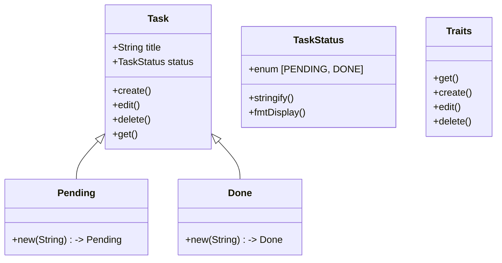

```mermaid
classDiagram
      Task <|-- Pending
      Task <|-- Done
      Task : +String title
      Task : +TaskStatus status
	  Task : +create()
	  Task : +edit()
	  Task : +delete()
	  Task : +get()
      class Pending{
          +new(String) -> Pending
      }
      class Done{
          +new(String) -> Done
      }
	  TaskStatus : +enum [PENDING, DONE]
      TaskStatus : +stringify()
      TaskStatus : +fmtDisplay()
	  Traits: +get()
	  Traits: +create()
	  Traits: +edit()
	  Traits: +delete()
```

ref: https://support.typora.io/Draw-Diagrams-With-Markdown/